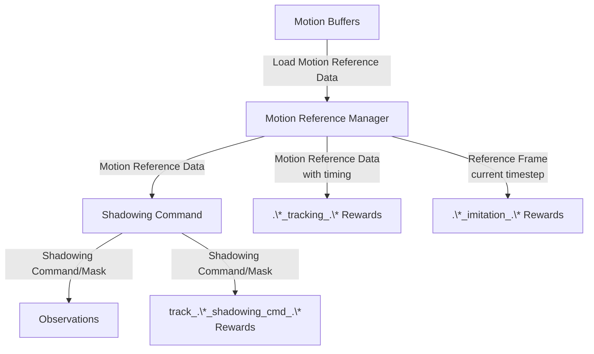
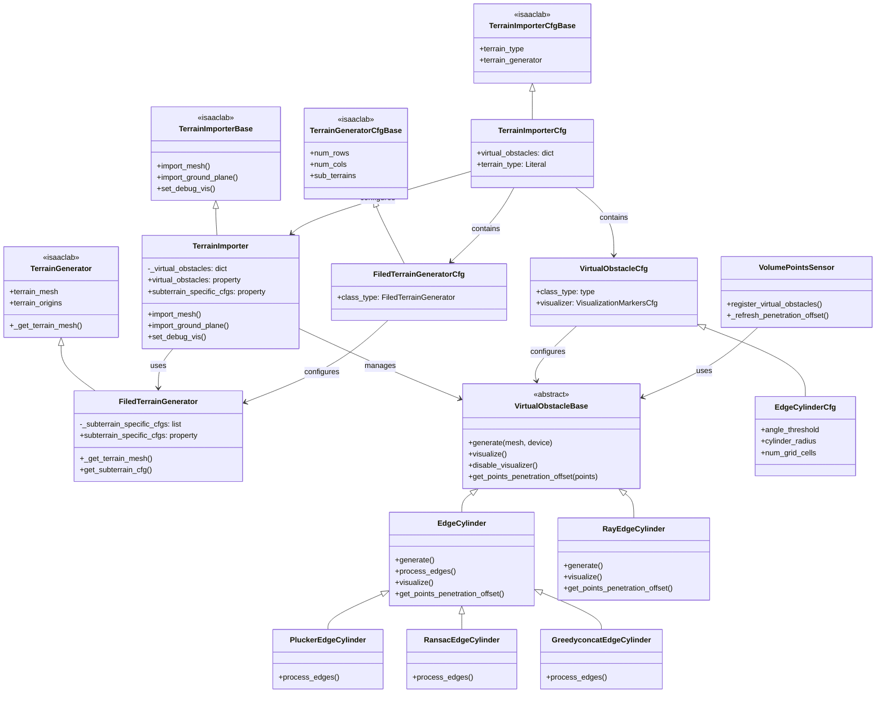

# Documentations and Core concepts

## Monitor
A monitor is an environment component that the user can use to store the simulation status and plot them in tensorboard.

---

## Multi Reward Manager
A multi reward manager is an environment component that substitute the default reward manager. It allows the user to define multiple rewards group for the use of advantage-mixing / multi-critic RL.

### Example Configuration

```python
from instinctlab.managers import MultiRewardCfg
from isaaclab.managers import RewardTermCfg as RewTermCfg
from isaaclab.managers import SceneEntityCfg
from isaaclab.utils import configclass
import instinctlab.envs.mdp as instinct_mdp
import isaaclab.envs.mdp as mdp

# Define individual reward terms
@configclass
class RewardsCfg:
    # Imitation rewards (motion matching)
    base_position_imitation_gauss = RewTermCfg(
        func=instinct_mdp.base_position_imitation_gauss,
        weight=0.5,
        params={"std": 0.3},
    )
    base_rot_imitation_gauss = RewTermCfg(
        func=instinct_mdp.base_rot_imitation_gauss,
        weight=0.5,
        params={"std": 0.4, "difference_type": "axis_angle"},
    )
    link_pos_imitation_gauss = RewTermCfg(
        func=instinct_mdp.link_pos_imitation_gauss,
        weight=1.0,
        params={
            "combine_method": "mean_prod",
            "in_base_frame": False,
            "in_relative_world_frame": True,
            "std": 0.3,
        },
    )

    # Regularization rewards
    action_rate_l2 = RewTermCfg(func=mdp.action_rate_l2, weight=-0.1)
    joint_limit = RewTermCfg(
        func=mdp.joint_pos_limits,
        weight=-10.0,
        params={"asset_cfg": SceneEntityCfg("robot", joint_names=[".*"])},
    )
    undesired_contacts = RewTermCfg(
        func=mdp.undesired_contacts,
        weight=-0.1,
        params={
            "sensor_cfg": SceneEntityCfg("contact_forces", body_names=[".*"]),
            "threshold": 1.0,
        },
    )

# Define reward groups (must inherit from MultiRewardCfg)
@configclass
class RewardGroupsCfg(MultiRewardCfg):
    # Single reward group containing all terms
    rewards = RewardsCfg()

    # Optional: Define multiple groups for multi-critic RL
    # rewards_group_1 = RewardsCfg()  # First critic
    # rewards_group_2 = RewardsCfg()  # Second critic

# In your environment configuration
@configclass
class EnvCfg(InstinctLabRLEnvCfg):
    rewards: RewardGroupsCfg = RewardGroupsCfg()
    # ... other configs ...
```

**Key Points:**
- Each reward group is a config class containing `RewardTermCfg` instances
- The `MultiRewardManager` computes rewards separately for each group
- The `MultiRewardManager` is used only if the `rewards` config is a `MultiRewardCfg` instance.
- Returns a dict with shape `(num_envs, num_groups)` for multi-critic RL
- Supports `combine_method` per group: `"sum"` (default) or `"prod"` for term combination

---

## Motion Reference

In general, the data-flow is designed to be as follows:



### Motion Reference Manager
- A motion reference manager is a scene entity inherited from `Sensor`, which provides the motion reference data for the robot.

- It also manages multiple motion buffer, either from file or generated.

- It also provides functionality to spread the motion trajectories across different processes.

### Motion Reference Data
- A motion reference data is a data structure that stores the motion reference data, which is the expected future motion that the robot should reach.

- The motion reference data contains a sequence of motion (frame). You may set the interval of each frame. If you set  `data_start_from` to `"current_time"`, the motion reference data serve as common general motion tracking setting.

### Motion Reference Frame
- A motion reference frame is a single frame of the motion reference data. It contains the expected state of the robot at that each current time step.

- To the reuse of data structure, the motion reference frame always has a time dimension with length 1.

### Motion Buffer
- A motion buffer is the file handler to the motion data. The basic functional implementation is `motion_reference.motion_files.amass_motion:AmassMotion`.

- Please read the source code of `motion_reference.motion_files.amass_motion:AmassMotion._load_motion_sequences` and `motion_reference.motion_files.amass_motion:AmassMotion._read_motion_file` for the supported file format.

- Retargeted motion files with name ends with `retargeted.npz` are recommended.

### Shadowing Command
- A shadowing command is a command that the robot should follow. It is typically generated from the motion reference data.

- Each shadowing command MUST update as soon as the motion reference data is updated.

### Imitation
- Imitation and rewards with `.*_imitation_.*` means the robot should focus on the motion at the each time step no matter how the motion reference data is set.

### Tracking Motion Reference Data
- By Tracking and rewards with `.*_tracking_.*`, it means the robot should focus on the motion only when the expected reaching time is reached. For example, if the expected reaching time is 1 second in the future, the robot should focus on the motion only after 1 second has passed.

- NOTE: This is a legacy issue that in IsaacLab, rewards starting with `track` computes the error between the robot's current state and the command state.

### Track Shadowing Command
- Shadowing and rewards with `track_.*_shadowing_cmd_.*` means the robot should focus on meeting the shadowing command only. Even if the shadowing command may distort the motion reference data, the robot should follow the shadowing command.


### Example Configurations

#### Motion Reference Manager Configuration

```python
from instinctlab.motion_reference import MotionReferenceManagerCfg
from instinctlab.motion_reference import AmassMotionCfgBase

# Configure motion buffer (e.g., AMASS dataset)
class AMASSMotionCfg(AmassMotionCfgBase):
    path = "~/Datasets/AMASS_dataset"
    motion_bin_length_s = 1.0
    frame_interval_s = 0.1
    env_starting_stub_sampling_strategy = "concat_motion_bins"

# Configure motion reference manager and put it in SceneCfg
motion_reference_cfg = MotionReferenceManagerCfg(
    prim_path="{ENV_REGEX_NS}/Robot/torso_link",
    robot_model_path="path/to/robot.urdf",
    reference_prim_path="/World/envs/env_.*/RobotReference/torso_link",
    link_of_interests=[
        "pelvis", "torso_link",
        "left_shoulder_roll_link", "right_shoulder_roll_link",
        "left_elbow_link", "right_elbow_link",
        # ... more links
    ],
    frame_interval_s=0.1,  # 10 Hz frame rate
    update_period=0.02,     # Update every 0.02s (50 Hz)
    num_frames=10,          # Look ahead 10 frames (1 second)
    data_start_from="current_time",  # Start from current timestep
    motion_buffers={
        "AMASSMotion": AMASSMotionCfg(),
    },
)
```


#### Termination terms to reset motion reference manager
**NOTE: This termination term must be applied for each motion reference manager you use.**

```python
from isaaclab.managers import TerminationTermCfg

# Add this to your termination cfg
class TerminationsCfg:
    motion_reference_exhausted = TerminationTermCfg(
        func=instinct_mdp.dataset_exhausted,
        params={
            "reference_cfg": SceneEntityCfg("motion_reference"),
            # "reset_without_notice": True,
            #### If True, this termination term will only reset the exhausted env in the motion reference manager, but not return any True to reset the environment.
        },
    )
```


#### Shadowing Command Configuration

```python
from instinctlab.envs.mdp import PoseRefCommandCfg, JointPosRefCommandCfg
from isaaclab.managers import SceneEntityCfg

# Base pose reference command (position + orientation)
pose_ref_command = PoseRefCommandCfg(
    motion_reference=SceneEntityCfg("motion_reference"),
    asset_cfg=SceneEntityCfg("robot"),
    anchor_frame="robot",  # Reference in robot's local frame
    rotation_mode="axis_angle",  # Use axis-angle representation
    realtime_mode=0,  # No real-time updates
    current_state_command=False,  # Don't include current state
)

# Joint position reference command
joint_pos_ref_command = JointPosRefCommandCfg(
    motion_reference=SceneEntityCfg("motion_reference"),
    asset_cfg=SceneEntityCfg("robot"),
    current_state_command=True,  # Include current joint positions
)
```

#### Reward Configuration Examples

```python
from instinctlab.envs.mdp import RewTermCfg
from isaaclab.managers import SceneEntityCfg
import instinctlab.envs.mdp as instinct_mdp


@configclass
class RewardsCfg:
    # Tracking reward - checks timing
    base_position_tracking = RewTermCfg(
        func=instinct_mdp.base_position_tracking_gauss,
        params={
            "asset_cfg": SceneEntityCfg("robot"),
            "reference_cfg": SceneEntityCfg("motion_reference"),
            "check_at_keyframe_threshold": -1,  # Check at expected time
            "tracking_sigma": 0.2,
        },
    )

    # Imitation reward - checks every timestep
    joint_pos_imitation = RewTermCfg(
        func=instinct_mdp.joint_pos_imitation_gauss,
        params={
            "asset_cfg": SceneEntityCfg("robot"),
            "reference_cfg": SceneEntityCfg("motion_reference"),
            "std": 0.7,
            "masked": True,  # Only compute for unmasked joints
        },
    )

    # Shadowing command reward - tracks command only
    track_shadowing_cmd = RewTermCfg(
        func=instinct_mdp.track_pose_ref_shadowing_cmd_gauss,
        params={
            "command_cfg": SceneEntityCfg("pose_ref_command"),
            "asset_cfg": SceneEntityCfg("robot"),
        },
    )
```

#### Matching with pre-defined terrain mesh configurations

```python
from instinctlab.terrains import MotionMatchedTerrainCfg

# Add this to your event cfg
class EventsCfg:
    match_motion_ref_with_scene = EventTermCfg(
        func=instinct_mdp.match_motion_ref_with_scene,
        mode="startup",
        params={
            "motion_ref_cfg": SceneEntityCfg("motion_reference"),
        },
    )

```
---

## Virtual Obstacles (in Terrains)

Virtual obstacles are geometric representations of terrain features (typically sharp edges) that are generated from terrain meshes and used for collision detection and penetration computation in sensors. They enable robots to perceive and avoid dangerous terrain features without requiring explicit collision geometry in the simulation.

### Class Hierarchy and Relationships

The following diagram shows the class inheritance and composition relationships:



### Customized Terrain Importer

The `TerrainImporter` class extends IsaacLab's base terrain importer to add support for virtual obstacles. Key features include:

- **Virtual Obstacle Management**: Accepts a dictionary of virtual obstacle configurations in its config (`virtual_obstacles`). Each virtual obstacle is instantiated during terrain importer initialization.

- **Automatic Generation**: When a terrain mesh is imported (via `import_mesh`), all configured virtual obstacles are automatically generated from the terrain mesh. The generation happens before the mesh is imported into the simulator, allowing virtual obstacles to potentially modify the mesh if needed.

- **Access Interface**: Provides a `virtual_obstacles` property that returns a dictionary of all virtual obstacle instances, making them accessible to sensors and other components.

- **Visualization Support**: Integrates virtual obstacle visualization with the terrain importer's debug visualization system. When debug visualization is enabled, all virtual obstacles are visualized; when disabled, their visualizers are hidden.

- **Hacked Generator Support**: Supports a special `"hacked_generator"` terrain type that allows custom terrain generation workflows while maintaining compatibility with IsaacLab's terrain importer interface.

- **Subterrain Configuration Access**: Provides access to subterrain-specific configurations through the `subterrain_specific_cfgs` property, which delegates to the terrain generator if available.

### Customized Terrain Generator

The `FiledTerrainGenerator` class extends IsaacLab's `TerrainGenerator` to provide enhanced access to subterrain-specific configurations:

- **Configuration Tracking**: Intercepts the terrain mesh generation process (`_get_terrain_mesh`) to record and store the specific configuration for each subterrain. This includes the original configuration plus any modifications made during generation (such as difficulty and seed values).

- **Subterrain Access**: Provides two methods to access subterrain configurations:
  - `subterrain_specific_cfgs`: Returns a list of all subterrain configurations, indexed by row and column (access pattern: `configs[row_id * num_cols + col_id]`).
  - `get_subterrain_cfg(row_ids, col_ids)`: Retrieves configurations for specific subterrains by their row and column indices. Supports both single indices and tensor-based batch queries.

- **Use Case**: This interface is particularly useful when you need to query or modify terrain properties based on the specific subterrain where a robot is located, enabling terrain-aware behaviors and curriculum learning.

### Virtual Obstacle

Virtual obstacles are abstract geometric representations that can be generated from terrain meshes. They provide collision detection and penetration computation capabilities for sensors.

- **Base Interface**: The `VirtualObstacleBase` abstract class defines the core interface that all virtual obstacles must implement:
  - `generate(mesh, device)`: Generates the virtual obstacle geometry from a terrain mesh.
  - `visualize()`: Visualizes the virtual obstacle in the simulation (typically as markers).
  - `disable_visualizer()`: Hides the visualization.
  - `get_points_penetration_offset(points)`: Computes penetration offsets for given points, returning vectors pointing from the obstacle surface to the points (used by sensors for collision detection).

- **Edge Detection Implementations**: Currently, virtual obstacles are primarily generated using edge detection algorithms. The system provides several edge detection variants:
  - **EdgeCylinder**: Base class that detects sharp edges in meshes using face adjacency angles. Edges exceeding a configurable angle threshold are identified and represented as cylinders.
  - **PluckerEdgeCylinder**: Uses Plücker coordinates to merge collinear edge segments, reducing redundancy in edge representation.
  - **RansacEdgeCylinder**: Uses RANSAC algorithm with DBSCAN clustering to fit line segments to edge points, robust to noise.
  - **GreedyconcatEdgeCylinder**: Uses a greedy concatenation algorithm to connect adjacent edges based on angle thresholds, creating longer continuous edge segments.
  - **RayEdgeCylinder**: Uses ray casting from multiple camera viewpoints to detect edges in depth and normal images, then applies edge detection (Canny) and clustering to extract edge segments.

- **Spatial Optimization**: Edge-based virtual obstacles use a `CylinderSpatialGrid` for efficient spatial partitioning, enabling fast penetration queries for large numbers of edge cylinders.

- **Integration with Sensors**: Virtual obstacles are registered with sensors (e.g., `VolumePointsSensor`) through the `register_virtual_obstacles` method. Sensors use the `get_points_penetration_offset` method to compute penetration depths and offsets for their sampled points, enabling terrain-aware perception and collision avoidance.

### Example Configuration

#### Terrain Importer with Virtual Obstacles

```python
from instinctlab.terrains import TerrainImporterCfg
from instinctlab.terrains.virtual_obstacle import (
    PluckerEdgeCylinderCfg,
    RansacEdgeCylinderCfg,
    GreedyconcatEdgeCylinderCfg,
    RayEdgeCylinderCfg,
)
from isaaclab.terrains import TerrainGeneratorCfg
from isaaclab.sensors import patterns

# Configure terrain importer with virtual obstacles. Do remember to place it into SceneCfg.
terrain_cfg = TerrainImporterCfg(
    prim_path="/World/ground",
    terrain_type="generator",  # or "hacked_generator" for custom generator
    terrain_generator=TerrainGeneratorCfg(
        # ... terrain generator config ...
    ),
    virtual_obstacles={
        # Plucker-based edge detection (merges collinear edges)
        "edges_plucker": PluckerEdgeCylinderCfg(
            angle_threshold=70.0,  # degrees
            cylinder_radius=0.2,  # meters
            num_grid_cells=64**3,  # spatial grid resolution
        ),
        # RANSAC-based edge detection (robust to noise)
        "edges_ransac": RansacEdgeCylinderCfg(
            angle_threshold=70.0,
            cylinder_radius=0.2,
            max_iter=500,
            point_distance_threshold=0.04,
            min_points=5,
            cluster_eps=0.08,
        ),
        # Greedy concatenation (connects adjacent edges)
        "edges_greedy": GreedyconcatEdgeCylinderCfg(
            angle_threshold=70.0,
            cylinder_radius=0.2,
            adjacent_angle_threshold=30.0,
            min_points=5,
        ),
        # Ray-based edge detection (from multiple viewpoints)
        "edges_ray": RayEdgeCylinderCfg(
            cylinder_radius=0.2,
            max_iter=500,
            point_distance_threshold=0.005,
            min_points=15,
            cluster_eps=0.08,
            ray_pattern=patterns.GridPatternCfg(
                resolution=0.01,
                size=[6, 6],
                direction=(0.0, 0.0, -1.0),
            ),
            ray_offset_pos=[0.0, 0.0, 1.0],
            max_ray_depth=8.0,
            depth_canny_thresholds=[250, 300],
            normal_canny_thresholds=[80, 250],
            cutoff_z_height=0.1,
        ),
        # Disable a virtual obstacle by setting to None
        # "edges": None,
    },
)
```

#### Registering Virtual Obstacles with Sensors

```python
from instinctlab.envs.mdp import EventTerm
from instinctlab.envs.mdp.events import register_virtual_obstacle_to_sensor
from isaaclab.managers import SceneEntityCfg

# In your EventsCfg class
class EventsCfg:
    # Register virtual obstacles to volume points sensor at startup
    register_virtual_obstacles = EventTerm(
        func=register_virtual_obstacle_to_sensor,
        mode="startup",  # Register once at environment startup
        params={
            "sensor_cfgs": SceneEntityCfg("leg_volume_points"),
            # Or multiple sensors:
            # "sensor_cfgs": [
            #     SceneEntityCfg("leg_volume_points"),
            #     SceneEntityCfg("arm_volume_points"),
            # ],
        },
    )
```

#### Accessing Virtual Obstacles in Rewards

```python
from instinctlab.envs.mdp import RewTermCfg
import instinctlab.envs.mdp as instinct_mdp

# Reward that penalizes penetration into virtual obstacles
volume_points_penetration = RewTermCfg(
    func=instinct_mdp.volume_points_penetration,
    params={
        "sensor_cfgs": [SceneEntityCfg("leg_volume_points"), SceneEntityCfg("arm_volume_points")],
    },
)

# Reward that penalizes penetration into virtual obstacles
volume_points_step_safety = RewTermCfg(
    func=instinct_mdp.volume_points_step_safety,
    params={
        "sensor_cfgs": [SceneEntityCfg("leg_volume_points"), SceneEntityCfg("arm_volume_points")],
        "contact_forces_cfg": SceneEntityCfg("contact_forces"),
    },
)
```

- **Point Sampling**: Generates a pattern of points (typically using a 3D grid) in the local frame of each body. The points are defined relative to the body's origin and orientation.

- **World Frame Tracking**: Transforms all sampled points to the world frame and tracks their positions (`points_pos_w`) and velocities (`points_vel_w`) as the bodies move and rotate.

- **Penetration Detection**: Integrates with virtual obstacles (registered via `register_virtual_obstacles`) to compute penetration offsets. For each point, it queries all registered virtual obstacles and returns the maximum penetration offset vector pointing from the obstacle surface toward the point.

- **Body State Tracking**: Tracks the pose and velocity of each body (`pos_w`, `quat_w`, `vel_w`, `ang_vel_w`) that has volume points attached.

### Configuration

- **Points Generator**: Configurable via `points_generator` (e.g., `Grid3dPointsGeneratorCfg`) to define the spatial pattern of sampled points. The default grid generator creates a 3D grid with configurable bounds and resolution along each axis.

- **Body Selection**: Uses `prim_path` to specify which bodies to attach volume points to. Supports filtering via `filter_prim_paths_expr` for more precise body selection.

- **Visualization**: Provides debug visualization with two marker types:
  - Green spheres for normal volume points
  - Red spheres for points that have penetrated virtual obstacles

### Integration with Virtual Obstacles

The sensor must be registered with virtual obstacles (typically during environment initialization) to enable penetration detection:

```python
sensor.register_virtual_obstacles(terrain.virtual_obstacles)
```

During each update cycle, the sensor queries all registered virtual obstacles to compute penetration offsets. If multiple obstacles overlap, it keeps the maximum penetration depth.

***NOTE:*** Do call `register_virtual_obstacles` as a startup event in your environment EventsCfg.
```python
    register_virtual_obstacles = EventTerm(
        func=instinct_mdp.register_virtual_obstacle_to_sensor,
        mode="startup",
        params={
            "sensor_cfgs": SceneEntityCfg("leg_volume_points"),
        },
    )
```

### Data Structure

- Body states: `pos_w`, `quat_w`, `vel_w`, `ang_vel_w` (shape: `(N, B, ...)`)
- Point states: `points_pos_w`, `points_vel_w` (shape: `(N, B, P, 3)`)
- Penetration: `penetration_offset` (shape: `(N, B, P, 3)`)

Where `N` is the number of environments, `B` is the number of bodies per environment, and `P` is the number of points per body.

### Use Cases

- **Collision Avoidance**: Detect when robot parts penetrate into dangerous terrain features (e.g., sharp edges detected as virtual obstacles).

- **Reward Shaping**: Used in reward functions (e.g., `volume_points_penetration`) to penalize penetration, often weighted by the velocity of penetrating points to encourage avoidance of fast-moving collisions.

---

## Noisy Grouped Sensor Camera

The Noisy Grouped Sensor Camera combines the Grouped RayCaster's dynamic mesh tracking capabilities with configurable noise pipelines and history buffers, making it suitable for sim-to-real transfer and robust perception training.

### Grouped RayCaster

The `GroupedRayCaster` extends the base `RayCaster` to support ray casting against multiple meshes that can move and update their positions dynamically during simulation. This is essential for scenarios where the robot or other objects in the scene are moving.

- **Dynamic Mesh Tracking**: Unlike the base RayCaster which uses static meshes, GroupedRayCaster tracks rigid body views for each mesh group and updates mesh transforms before each ray cast operation. This allows rays to correctly hit moving objects.

- **Collision Groups**: Each mesh and ray is assigned a collision group ID. Meshes with collision group `-1` are hit by all rays (global meshes like terrain). Meshes with collision group matching an environment ID are only hit by rays from that environment. This enables environment-specific ray casting in parallel simulations.

- **Multiple Mesh Sources**: Supports multiple `mesh_prim_paths` configurations, allowing rays to be cast against different sets of meshes (e.g., terrain, robot body parts, obstacles). Each mesh group can have its own rigid body view for transform updates.

- **Mesh Merging**: Can merge multiple meshes from Xform prims into a single warp mesh, useful for complex articulated structures. Supports auxiliary mesh linking via `aux_mesh_and_link_names` configuration.

- **Transform Updates**: Before each ray cast, updates the world transforms of all tracked meshes based on their associated rigid body views, ensuring accurate collision detection with moving objects.

### Noisy Grouped RayCaster

The `NoisyGroupedRayCasterCamera` extends `GroupedRayCasterCamera` with a configurable noise pipeline and history buffers:

- **Noise Pipeline**: Applies a sequence of noise transformations to sensor data (e.g., depth images). Common noise types include:
  - **Depth Artifacts**: Simulates sensor artifacts and measurement errors
  - **Depth Stereo Noise**: Adds stereo camera-like noise patterns
  - **Depth Sky Artifacts**: Simulates sky detection artifacts
  - **Latency Noise**: Introduces temporal delays by sampling from history buffers
  - **Gaussian/Uniform Noise**: Basic additive or multiplicative noise
  - **Normalization**: Normalizes depth values to a specified range

- **History Buffers**: Maintains temporal history of sensor outputs for each configured data type. Useful for:
  - Latency simulation (using past frames)
  - Temporal filtering
  - Motion estimation

- **Dual Output**: Provides both clean (`data_type`) and noisy (`data_type_noised`) outputs, allowing comparison and training with different noise levels.

- **Configurable Data Types**: Noise can be applied selectively to different sensor outputs (e.g., `distance_to_image_plane`, `normals`, etc.) based on configuration.

- **Sim-to-Real Transfer**: The noise pipeline helps bridge the sim-to-real gap by simulating real-world sensor imperfections, making trained policies more robust to sensor noise in deployment.

### Example Configuration

```python
from instinctlab.sensors.grouped_raycaster import GroupedRayCasterCfg, NoisedGroupedRayCasterCameraCfg

# Configure sensor as scene entity cfg
grouped_ray_caster = GroupedRayCasterCfg(
    prim_path="/World/envs/env_.*/Robot/head_link",
    # NOTE: The prim path must be able to match the bodies in the scene. For single rigid body, the prim path should also end with ".*"
    mesh_prim_paths=["/World/ground/", "/World/envs/env_.*/Robot/(?!.*head_link).*", "/world/envs/env_.*/cone1/.*"],
    attach_yaw_only=False,
    pattern_cfg=PinholeCameraPatternCfg(
        focal_length=1.0,
        horizontal_aperture=2 * math.tan(math.radians(89.51) / 2),
        vertical_aperture=2 * math.tan(math.radians(58.29) / 2),
    ),
)

# Configure noisy camera (RealSense D435i on Unitree G1 29dof as example)
noisy_camera = NoisyGroupedRayCasterCameraCfg(
    prim_path="{ENV_REGEX_NS}/Robot/torso_link",
    mesh_prim_paths=["/World/ground/", "/World/envs/env_.*/Robot/.*"],
    # Use aux_mesh_and_link_names for those mesh names that are not the same as the link name or be fixed in other links. Check the configuration definition file for more details.
    aux_mesh_and_link_names={
        "torso_link_rev_1_0": None,
        "waist_yaw_link_rev_1_0": "waist_yaw_link",
        "waist_roll_link_rev_1_0": "waist_roll_link",
        "head_link": "head_link",
        "left_rubber_hand": "left_rubber_hand",
        "right_rubber_hand": "right_rubber_hand",
    },
    offset=NoisyGroupedRayCasterCameraCfg.OffsetCfg(
        pos=(
            0.04764571478 + 0.0039635 - 0.0042 * math.cos(math.radians(48)),
            0.015,
            0.46268178553 - 0.044 + 0.0042 * math.sin(math.radians(48)) + 0.016,
        ),
        rot=(
            math.cos(math.radians(0.5) / 2) * math.cos(math.radians(48) / 2),
            math.sin(math.radians(0.5) / 2),
            math.sin(math.radians(48) / 2),
            0.0,
        ),
        convention="world",
    ),
    attach_yaw_only=False,
    pattern_cfg=patterns.PinholeCameraPatternCfg(
        focal_length=1.0,
        horizontal_aperture=2 * math.tan(math.radians(87) / 2),  # fovx
        vertical_aperture=2 * math.tan(math.radians(58) / 2),  # fovy
        height=int(270 / 10),
        width=int(480 / 10),
    ),
    data_types=["distance_to_image_plane"],
    noise_pipeline={
        # "depth_contour_noise": DepthContourNoiseCfg(
        #     contour_threshold=1.8,  # in [m]
        #     maxpool_kernel_size=1,
        # ),
        "depth_artifact_noise": DepthArtifactNoiseCfg(),
        "stereo_noise": RangeBasedGaussianNoiseCfg(
            max_value=1.2,
            min_value=0.12,
            noise_std=0.02,
        ),
        "sky_artifact_noise": DepthSkyArtifactNoiseCfg(),
        # "stereo_too_close_noise": StereoTooCloseNoiseCfg(),
        # These last two noise model will affect the processing on the onboard device.
        "gaussian_blur_noise": GaussianBlurNoiseCfg(
            kernel_size=3,
            sigma=0.5,
        ),
        "normalize": DepthNormalizationCfg(
            depth_range=(0.0, 1.5),
            normalize=True,
        ),
        "crop_and_resize": CropAndResizeCfg(
            crop_region=(2, 2, 2, 2),
            resize_shape=(18, 32),
        ),
    },
    # data_histories={"distance_to_image_plane": 5},
    update_period=1 / 60,
    debug_vis=False,
    depth_clipping_behavior="max",  # clip to the maximum value
    min_distance=0.05,
    max_distance=2.0,
)
```
